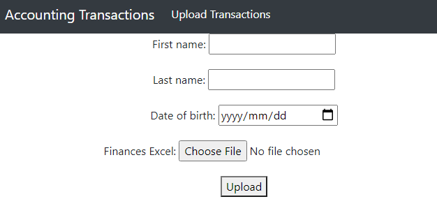
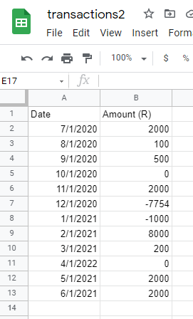
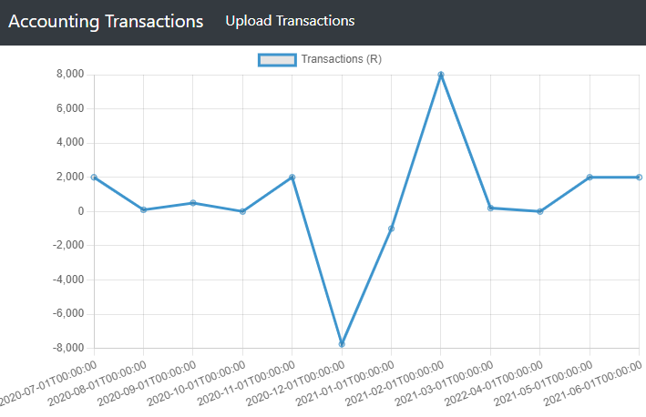
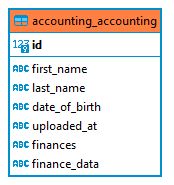
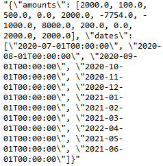
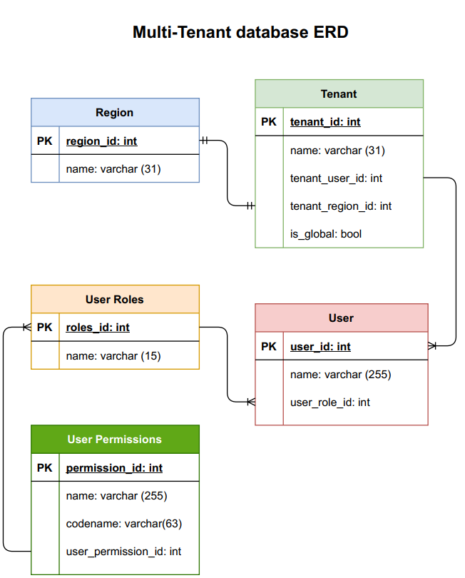

# Finances App

## This GOT ME A JOB 😃

View and assign tasks to users

## Usage

* Install and create virtualenv 

```bash
python install virtualenv
virtualenv venv
```

* Activate virtualenv and install dependencies

```bash
for Linux and Mac:
source venv/bin/activate

for Windows
/venv/Scripts/activate

pip install -r requirements.txt
```

* Run Django on your local server

```bash
python manage.py migrate
python manage.py runserver
```

* Open http://127.0.0.1:8000/ in your browser and enter details



* Upload excel sheet in the following format:



* Once you submit you'll be directed to the chart page



## Solution Explanation

* This web app uses Django.
* Each form uploaded stores the users name, date of birth and file (in the form of the file location) to the Accounting model

* Once the file is uploaded, the data is extracted using [openpyxl](https://openpyxl.readthedocs.io) and saved as a JSON data field to the correspoing model.

* The user is then directed to the chart page which graphs all their data using [Chart.js](https://www.chartjs.org/docs/latest/charts/line.html)


## Multi-Tenant ERD solution for organisation



### Explanation

1. The regions the organisation operate in are stored in the Region datbase.
2. Each Region has a one-to-one relationship with a tenant.
3. The Tenant table has a is_global boolean field to indicate whether the Region is
gloabl so that they can see the user data of all regions.
4. Each tenant will have multiple users and each user has a role. The assumption is that
global will not have it's own users but be able to see other regions users.
5. Each user has a user role.
6. The User Permssions table determines what action each user role allows each user.
The name field describe the permission. The codename is a shortened version of the
name for usability. This allows only the admin of a tenant to add and authenticate
users.
7. This is related to other user permissions for each user role.
