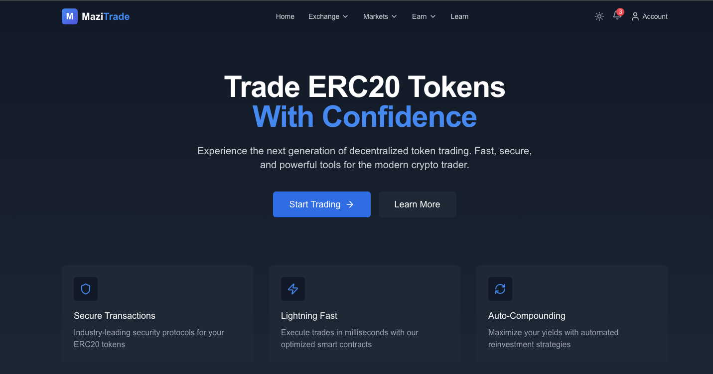

# EC20-Page

A modern, responsive cryptocurrency trading platform UI built with NextJS and Tailwind CSS. This project showcases a sleek hero section and dynamic navbar for an enhanced user experience.



🔗 **Live Demo**: [EC20-Page on Vercel](https://ec-20-page.vercel.app/)

## ✨ Features

- **Responsive Design** - Seamlessly adapts to desktop, tablet, and mobile devices
- **Dark Mode Support** - Built with a sleek dark theme for cryptocurrency applications
- **Dynamic Navigation** - Dropdown menus and responsive mobile navigation
- **Modern Visual Effects** - Gradient backgrounds, blur effects, and smooth transitions

## 🚀 Getting Started

### Prerequisites

- Node.js (v18.0 or higher recommended)
- npm

### Installation

1. Clone the repository:

   ```bash
   git clone https://github.com/yourusername/EC20-Page.git
   cd EC20-Page
   ```

2. Install dependencies:

   ```bash
   npm install
   ```

3. Run the development server:

   ```bash
   npm run dev
   ```

4. Open [http://localhost:3000](http://localhost:3000) in your browser to see the application.

## 🛠️ Technologies Used

- **NextJS 15** - React framework for production-grade applications
- **Tailwind CSS** - Utility-first CSS framework for rapid UI development
- **Lucide React** - Beautiful, consistent icon set
- **React Hooks** - For state management and side effects

## 🎨 Design Resources

### Styling Tools

- [Tailwind CSS Gradient Generator](https://www.creative-tim.com/twcomponents/gradient-generator)
- [Lucide React Icons](https://lucide.dev/guide/packages/lucide-react)
- [Tailwind UI Components](https://v1.tailwindcss.com/components/navigation#responsive-header)
- [Flowbite Marketing Blocks](https://flowbite.com/blocks/marketing/hero/)
- [Flowbite Navbar Components](https://flowbite.com/docs/components/navbar/)

### Inspiration

- [Bankless Tools Token Hub](https://www.bankless.com/tools/token-hub)
- [CoinDesk Best Crypto Hubs](https://www.coindesk.com/focus/best-crypto-hubs-2023)
- [Wibmo Token Hub](https://wibmo.co/token-hub/)

## 📚 Research Resources

For educational purposes and presentations:

- [Kaleido: Create an ERC20 Token](https://www.kaleido.io/blockchain-blog/create-an-erc20-token)
- [Investopedia: What is ERC20](https://www.investopedia.com/news/what-erc20-and-what-does-it-mean-ethereum/)
- [YouTube Tutorial on ERC20 Tokens](https://www.youtube.com/watch?v=7RWzmQMc5AQ)

---

Built with ❤️ by [Xolani Mazibuko]
