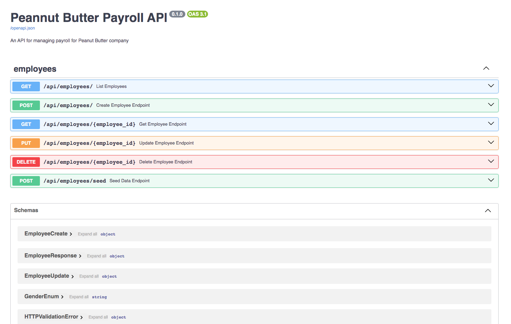

# Peanut-Butter-Payroll-Backend
a FastAPI application for peanut butter payroll using Postgres and Jenkins for deployment



🔗 **Live Demo**: [Peanut Butter Payroll Backend on Render](https://peanut-butter-payroll-backend.onrender.com/docs)

## Table of Contents
- [Peanut-Butter-Payroll-Backend](#peanut-butter-payroll-backend)
  - [Table of Contents](#table-of-contents)
  - [Installation](#installation)
    - [Local Setup](#local-setup)
    - [Frontend Setup](#frontend-setup)
    - [Docker Setup](#docker-setup)
  - [Using the application](#using-the-application)
  - [Tools and Justifications](#tools-and-justifications)

## Installation

### Local Setup

1. **Create a virtual environment and install dependencies:**

```sh
make venv
make install-packages
```

2. **Make migrations and migrate the database:**

```sh
make makemigrations
make migrate
```

3. **Run the application locally:**

```sh
make run-local
Make migrations and migrate the database:
```

### Docker Setup
Install Docker and Docker Compose if you haven't already.
(Install Docker)[https://docs.docker.com/engine/install/]

1. **Docker Setup**
Build and run Docker containers:

```sh
make up
```

2. **Destroy Docker containers:**

```sh
make down
```

3. **View logs:**

```sh
make logs
```

4. **Make migrations and migrate the database within Docker (if needed):**
(Migrations have been made and application migrates when it starts up.)

```sh
make docker-makemigrations
make docker-migrate
```

## Using the application

1. **Open the application in your browser:**
   For the FastAPI application OpenAPI docs: [http://localhost:8000/docs](http://localhost:8000/docs)

    To create mock data for the database navigation to the FastAPI application OpenAPI docs and use the `POST /api/seed` endpoint or click on seed data in the FastAPI docs page.

## Tools and Justifications

- **FastAPI**: FastAPI is a modern, fast (high-performance), web framework for building APIs with Python 3.7+ based on standard Python type hints. It is easy to use, fast to develop with, and provides automatic interactive API documentation.
- **OpenAPI**: OpenAPI is a specification for building APIs. Comes standard with FastAPI.
- **PostgreSQL**: PostgreSQL is a powerful, open-source relational database management system that is widely used in production environments.
- **SQLAlchemy**: SQLAlchemy is a popular SQL toolkit and Object-Relational Mapping (ORM) library for Python. I feel like using an ORM will make it easier to interact with the database and write queries especially for other developers who may not be familiar with SQL.
- **asyncpg**: asyncpg is a fast PostgreSQL database client library for Python. It is designed for use with the async/await syntax and provides support for asynchronous I/O operations.
- **Docker**: Docker is a popular tool for building, shipping, and running applications in containers. It provides a lightweight and portable way to package applications and their dependencies, which makes it easy to deploy applications in different environments.


deploy