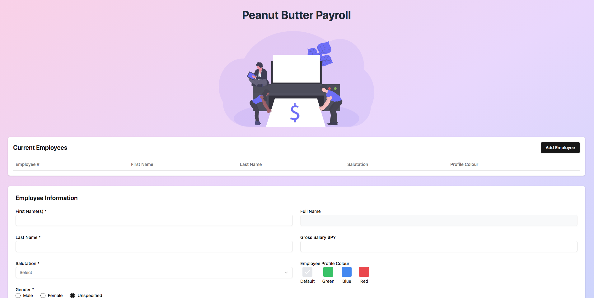

# Peanut Butter Payroll Frontend

A modern, responsive payroll management UI built with Next.js 15 and Tailwind CSS. This project provides a sleek, intuitive interface for managing employee records, featuring dynamic forms and interactive tables.



🔗 **Live Demo**: [Peanut Butter Payroll Frontend on Render](https://peanut-butter-payroll-frontend.onrender.com/)

## ✨ Features

- **Responsive Design**  
  Adapts seamlessly across desktop, tablet, and mobile devices.

- **Dynamic Employee Management**  
  View, add, update, and delete employee records with real‑time updates.

- **Modern Data Fetching**  
  Integrated with a FastAPI backend using React Query for efficient state management and caching.

- **Sleek Visuals**  
  Enjoy smooth transitions, beautiful gradient backgrounds, and a polished UI.

- **Error Feedback**  
  Immediate alert notifications when backend errors occur during operations.

- **Deployed using Jenkins**
  Formats, lints, type-checks and tests the code then deploys to Render.com which builds the code.

## 🚀 Getting Started

### Prerequisites

- Node.js (v18.0 or higher recommended)
- npm

### Installation

1. **Clone the repository:**
```bash
git clone https://github.com/mazi76erx2/peanut-butter-payroll-frontend.git
cd peanut-butter-payroll-frontend
```

2. **Install dependencies:**
```bash
npm install
```

3. **Create a `.env.local` file in the project root with the following content:**
```env
NEXT_PUBLIC_API_URL=http://localhost:8000
```

4. **Run the development server:**
```bash
npm run dev
```

5. **Open your browser:**  
   Visit http://localhost:3000 to see the application in action.

## 🛠️ Technologies Used

* [**Next.js 15**](https://nextjs.org/) - A React framework for production-grade applications.
* [**Tailwind CSS**](https://tailwindcss.com/) - A utility-first CSS framework for rapid UI development.
* [**React Query**](https://tanstack.com/query/latest) - For efficient data fetching and caching.
* [**Lucide React**](https://lucide.dev/) - A modern icon set for a sleek user interface.
* [**Turbopack**](https://turbo.build/) - Next.js 15's high-performance bundler.

## 🎨 Design Resources

### Styling Tools
* [Tailwind CSS Gradient Generator](https://tailwindcss.com/docs/gradient-color-stops)
* [Lucide React Icons](https://lucide.dev/icons/)
* [Tailwind UI Components](https://tailwindui.com/)
* [Flowbite Components](https://flowbite.com/)

### Inspiration
* Modern HR Dashboards
* Minimal UI Design
* Peanut Butter Branding

## 📚 Further Reading

* [Next.js Documentation](https://nextjs.org/docs)
* [Tailwind CSS Documentation](https://tailwindcss.com/docs)
* [React Query Documentation](https://tanstack.com/query/latest/docs/react/overview)

Built with ❤️ by [Your Name]

---

## Tools and Justifications

- **React**: React is a popular JavaScript library for building user interfaces.
- **NextJS**: The React website recommends using a framework for building React applications, and Next.js is a popular choice that provides a lot of useful features out of the box.
- **Tailwind CSS**: Tailwind CSS is a utility-first CSS framework that provides a set of pre-built utility classes that can be used to style web applications. It is easy to use and provides a flexible way to style web applications.
- **ReactQuery**: ReactQuery is a popular library for managing server state in React applications. It provides a way to fetch and cache data from a server and keep it in sync with the UI.
- **TypeScript**: TypeScript is a popular superset of JavaScript that provides static typing and other features to help developers write more robust and maintainable code. It is widely used in the React ecosystem and provides a lot of benefits for building web applications.


---

Built with ❤️ by [Xolani Mazibuko]
